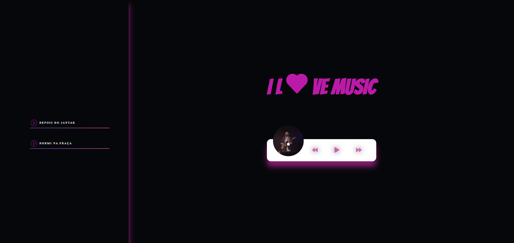
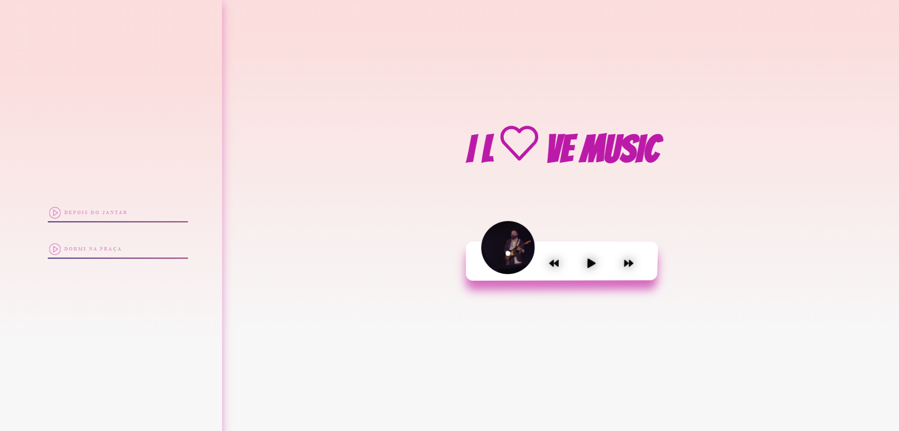

<h1 align="center">Music Player</h1>

  
  

## ✨ Tecnologias

Esse projeto foi desenvolvido com as seguintes tecnologias:

- [HTML]
- [CSS]
- [JavaScript]

## 💻 Projeto

Music Player é um website para ouvir musicas

## 🚀 Como executar

- Clone o repositório
- Abra a index.html no seu navegador

---
